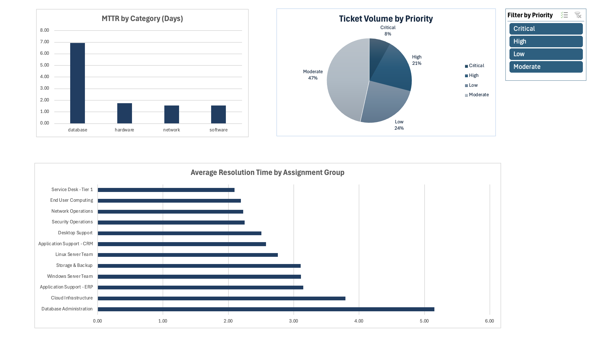

# IT Support Desk: Incident Analytics & ETL Pipeline

## 📌 Project Overview
Maintaining Service Level Agreement (SLA) compliance is critical for any enterprise IT service desk. This project showcases an end-to-end data analytics pipeline designed to identify bottlenecks in Mean Time to Resolution (MTTR) across various IT support tiers. 

The primary objective was to transition a messy, raw dataset into a fully automated, interactive dashboard using advanced Excel capabilities, allowing stakeholders to make data-driven decisions on resource allocation.

## 🛠️ Tech Stack & Methodology
* **Data Engineering (ETL):** Built an automated pipeline using **Excel Power Query**.
  * Executed text transformations to standardize inconsistent user inputs and category naming conventions.
  * Engineered custom logic to calculate total ticket resolution time (in days) while filtering out data integrity issues (e.g., negative time-traveler timestamps).
  * Implemented handling for null values representing active/on-hold tickets.
* **Data Modeling & Visualization:** Utilized **Excel Pivot Data Models** to aggregate MTTR metrics and deployed a dynamic, interactive dashboard connected via Slicers for real-time KPI filtering.
* **Data Generation:** Used LLM prompting to generate a highly realistic, skewed synthetic dataset of 1,000+ incident records mimicking raw IT helpdesk exports.

## 📊 Key Business Insights
Based on the dashboard analysis, several critical workflow bottlenecks were identified:
1. **The Primary Bottleneck:** The **Database Administration** assignment group is severely underperforming, taking an average of **5.15 days** to resolve tickets—significantly higher than the 2-3 day average of standard infrastructure teams.
2. **Category Delays:** Database-related incidents overall average nearly **7 days** to resolve, pointing to a systemic issue in how these specific technical requests are routed or escalated.
3. **Volume vs. Severity:** While 'Moderate' priority tickets make up the bulk of the volume (47%), filtering the dashboard by 'Critical' (8%) reveals that Database Admin and Cloud Infrastructure remain the slowest to respond, indicating a need for dedicated high-priority escalation protocols.

## 🚀 Business Impact 
By automating this ETL pipeline via Power Query, an IT management team would no longer need to manually clean weekly helpdesk data exports. The pipeline automatically ingests new data, updates the data model, and refreshes the dashboard. To improve overall SLA compliance, I recommend auditing the routing logic for Database categories to reduce manual triage time.

## 📸 Dashboard Preview
*(Interactive Excel dashboard filtering MTTR by Priority Level and Assignment Group)*

